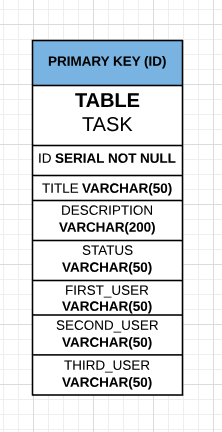

## PGR200 - Advanced Java Exam

------------------------------------------------------------------------------------------------------------

##### Database Design

------------------------------------------------------------------------------------------------------------
## Programkrav / Egenvurdering
- Programmet er bygget på en Maven Arkitektur med pgr200exam som root, med undermoduler kalt HTTP, Database og Client med tilhørende POM filer.
- Programmet bygger på TravisCI 
- Programmet er bygget på å kommunisere med GET og POST requests.
- Programmet anvender JUnit Test Library med
    - 8 tester representert i HTTP modulen
    - X tester representert i Database modulen
    - 0 tester representert i Client modulen
- I modulen Database finnes innlevering.properties som anvender curl for å leses.
- Grunnet begrenset tidsramme er databasen bygget på en enkel tabell, vi hadde derimot ønske om å anvende flere men grunnet en begrenset tidsramme var det ikke realistisk for oss å håndtere foreign keys, primary key forhold.
    (SE VEDLAGT "DATABASE DESIGN")
    
- Clienten har følgende commands "Create", "Show", "Update", "Exit".
- Databasen kommuniserer med HTTP som kravet i eksamensoppgaven spesifiserer.
- Database koden følger DAO pattern som ønsket i oppgaven.
- Vi har tatt høyde for SQL injections ved å anvende Prepared-Statements på tvers av Database/Http klassene/metodene.
- Screencast av programmeringsession funnet sted 31. Oktober 2018 (Ingen ny video ble tatt grunnet mangelende tid og en uforventet eksamensoppgave som var beskrevet som en individuell oppgave)
https://www.youtube.com/watch?v=9UEs4b3c9xI

------------------------------------------------------------------------------------------------------------

Fastsatte Eksamenskrav:

DATABASE
- DB skal inneholde Oppgavenavn, Beskrivelse, Status, Oppgavetakere
- DB Funksjoner:
  - Opprette
  - Liste opp
  - Se på detaljer
  - Endre oppgaver
------------------------------------------------------------------------------------------------------------

HTTP/SERVER
- Ta i bruk POST for opprettelse og oppdateringer av oppgaver
- Ta i bruk GET for å hente oppgaver
- Serveren lagrer oppgavene i Postgresql
- Conncection url, brukernavn og passord til DB skal ligge i properties-fil
------------------------------------------------------------------------------------------------------------

ANNET
- Demonstrere bruk av Github og Travis-CI
- README.md-fil som inneholder:
  - Fullstendig brukerveiledning
  - Egenvurdering
  - Kort designbeskrivelse
  - Diagram med beskrivelse av programfunksjonalitet
  - Link til screencast video(parprogrammering)
  - Skrive tester i JUnit

------------------------------------------------------------------------------------------------------------
